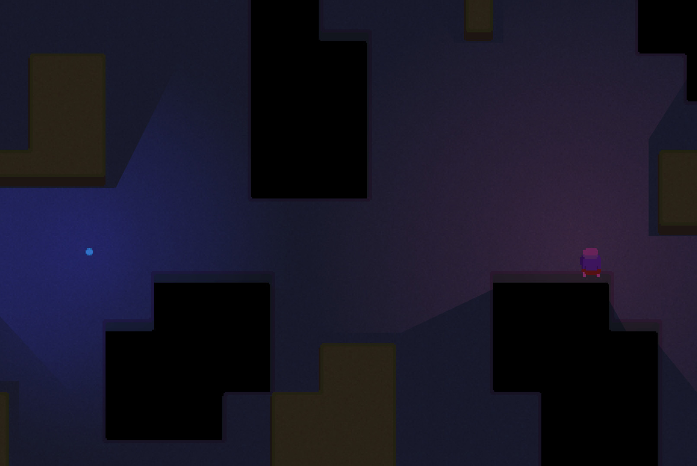

# Lighter

A dynamic light / shadow casting library for Löve.

## Installation
Clone the repo into your libs directory and require with 

    require 'path.to.lighter'

## How it works
For each light we cast rays towards wall polygon corners (aka map features). Checks intersections.
Builds a visibility polygon and uses it as the stencil for drawing the light.

As an optimization it uses a spatial map and calculates polygon bounding boxes on the fly so that only polygons within light radius get included in the visibility polygon calculations.

## Usage
    local Lighter = require 'path.to.lighter'

    local lighter = Lighter()

    local wall = {
        100, 100,
        300, 100,
        300, 300,
        100, 300
    }

    lighter:addPolygon(wall)

    local lightX, lightY = 500, 500

    -- addLight signature: (x,y,radius,r,g,b,a)
    local light = lighter:addLight(lightX, lightY, 500, 1, 0.5, 0.5)

    function love.update(dt)
        lightX, lightY = love.mouse.getPosition()
        lighter:updateLight(light, lightX, lightY)
    end

    function love.draw()
        love.graphics.polygon('fill', wall)
        lighter:drawLights()
    end

    -- Clean up
    -- lighter:removeLight(light)
    -- lighter:removePolygon(wall)

## Extra tip
### Drawing with a dimmer global illumination:
    -- Call after your light positions have been updated
    function preDrawLights()
      love.graphics.setCanvas({ lightCanvas, stencil = true})
      love.graphics.clear(0.4, 0.4, 0.4) -- Global illumination level
      self.lighter:drawLights()
      love.graphics.setCanvas()
    end
    
    -- Call after you have drawn your scene (but before UI)
    function drawLights()
      love.graphics.setBlendMode("multiply", "premultiplied")
      love.graphics.draw(lightCanvas)
      love.graphics.setBlendMode("alpha")
    end

## Credits:
  * Helped me understand the premise and their code provided me with tons of helpful tips for getting this implemented: [https://github.com/OneLoneCoder](https://github.com/OneLoneCoder)
  * The actual page I ended up following to really get the idea: [https://ncase.me/sight-and-light/](https://ncase.me/sight-and-light/)

### Screenshot of the library in use in a game

